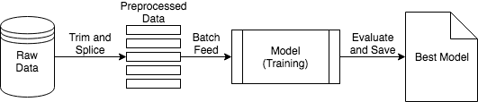
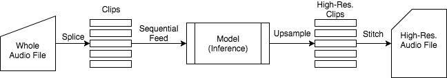
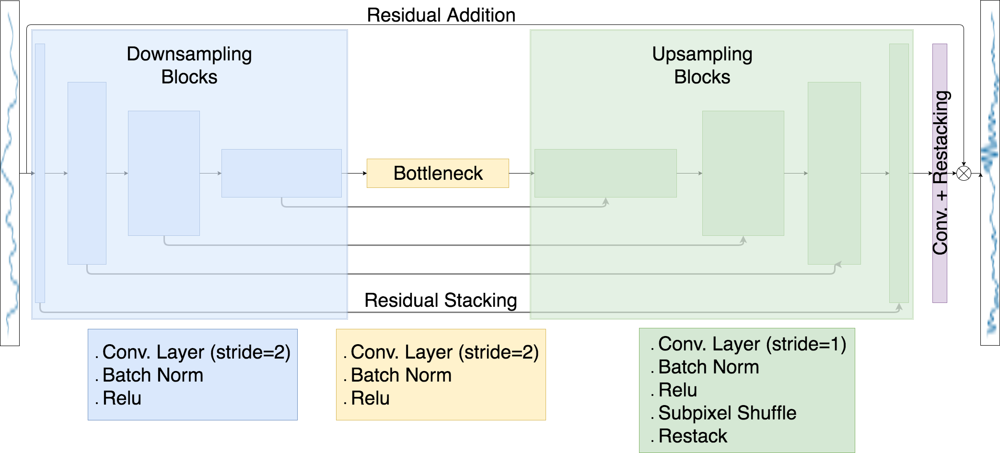
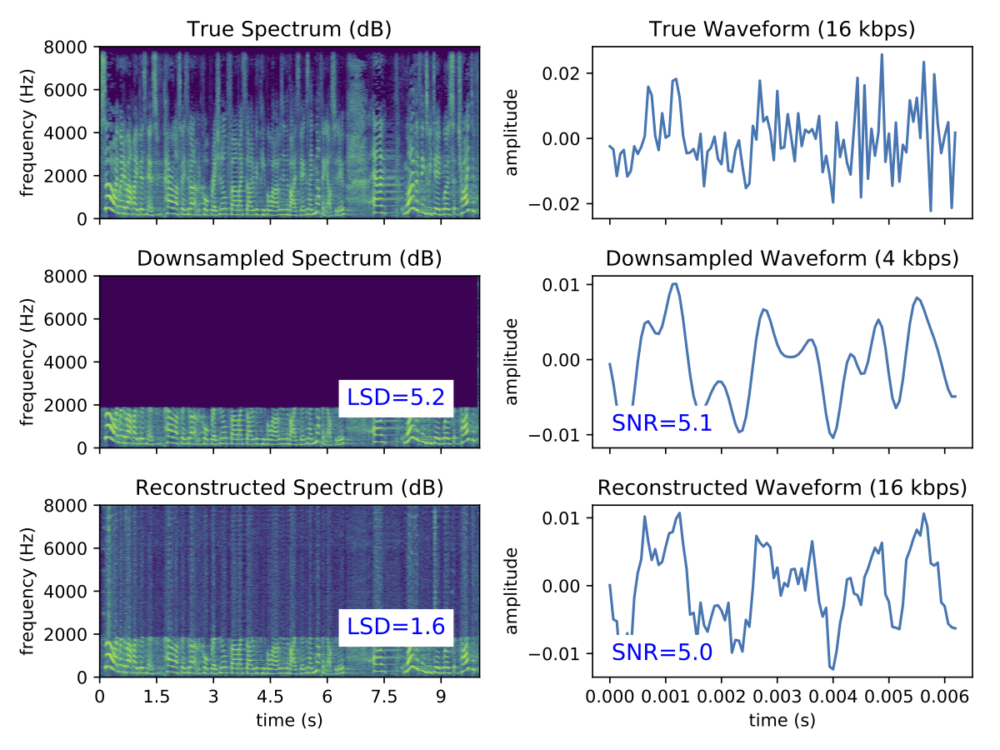

# EnglishSpeechUpsampler

This repository contains the nessecary Python scripts to train and run a deep
neural network to perform upsampling on an audio waveform.
This upsampling (also known as super-resolution) learns to infer missing high
frequencies in a downsampled audio waveform and is based on the work presented
in [this paper](https://openreview.net/pdf?id=S1gNakBFx).

## Overview

Audio super-resolution aims to reconstruct a high-resolution audio waveform
given a lower-resolution waveform as input.
There are several potential applications for this type of upsampling in such
areas as streaming audio and audio restoration.
A non-deep-learning solution is to use a database of audio clips to fill in
the missing frequencies in the downsampled waveform using a similarity metric
(see [this](http://ieeexplore.ieee.org/abstract/document/7251945) and
[this](http://ieeexplore.ieee.org/document/7336890) paper).
However, there is recent interest in using deep neural networks to accomplish
this upsampling.

## Dataset \& Workflow

There are a variety of domains where audio upsampling is useful.
Since I focused on a potential voice-over-IP application, the dataset I chose
for this repository is a collection of TED talks about 35 GB in size found
[here](http://www-lium.univ-lemans.fr/en/content/ted-lium-corpus).
Each talk is located in separate files with bit rates of 16 kbps which is
considered high quality for speech audio.
This dataset contains primarily well-articulated English speech in front an
audience from a variety of speakers.
These qualities regarding the TED talks are an approximation to what one may
expect during a voice-over-IP conversation.

The preprocessing steps are outlined in the above figure.
The first and last 30 seconds from each file are trimmed to remove the
TED logo.
The files are then split into 2 second clips and a separate, 4x
downsampled set of clips at 4 kbps are created along with a set at the original
16 kbps.
60% of the dataset are used during training while 20% are reserved for
validation and 20% for testing.

The training workflow outlined in the above figure uses the downsampled clips of
the data preprocessing steps and batch-feeds them into the model (a deep neural
network) to update its weights.
The model with the lowest validation score (denoted "Best Model") is saved for
later use.

The process of using the "Best Model" to upsample an audio file is given in the
above figure.
This workflow takes whole audio files, splices them into clips similarly to the
preprocessing steps, sequentially feeds them to trained model, stitches the
high-resolution clips back together, and saves the high-resolution file to disk.

## Model Architecture

The model architecture is a [U-Net](https://arxiv.org/abs/1505.04597) that uses
a one-dimensional analogue of
[subpixel convolutions](https://arxiv.org/abs/1609.05158) instead of
deconvolution layers.
The downsampled waveform is sent through eight downsampling blocks that are each
made of convolutional layers with a stride of two.
At each layer the number of filter banks is doubled so that while the dimension
along the waveform is reduced by half, the filter bank dimension is increased by
two.
The bottleneck layer is constructed identically to a downsampling block which
connects to eight upsampling blocks which have residual connections to the
downsampling blocks.
These residual connections allow for the sharing of features leanred from the
low-resolution waveform.
The upsampling blocks use a subpixel convolution that reorders information along
one dimension to expand the other dimensions.
A final convolutional layer with restacking and reordering operations is
residually added to the original input to yield the upsampled waveform.
The loss function used is the mean-squared error between the output waveform and
the original, high-resolution waveform.

## Performance

The above figure shows two quantitative measures of performance on a test sample
after 10 epochs of training.
On the left column are spectrograms of frequency versus time, and on the right
are plots of the waveform amplitude versus time.
The first row contains the spectrogram and waveform plots for the original,
high-resolution audio sample.
The middle row contains similar plots for the 4x downsampled version of the
original audio sample.
Notice that 3/4 of the highest frequencies are missing in the downsampled
frequency plot.
The last row contains the spectromgrams and waveform plots for the output of the
trained model.
Inset are two quantitative measures of performance: the signal-to-noise ratio
(SNR) and the log-spectral distance (LSD).
Higher SNR values represent clearer-sounding audio while lower LSD values
indicate matching frequency content.
The LSD value shows the neural network is attempting to restore the higher
frequencies wherever appropriate.
However, the slightly lower SNR value implies that the audio may not be as
clear-sounding.

## Installation Instructions

Make sure the [required software](##requirements-and-dependencies) is
installed.
To compile the custom C++ library that enables fast
[subpixel convolutions](https://arxiv.org/pdf/1609.05158.pdf),
`cd` into the `src` directory and run the
[COMPILE_FROM_BINARY](src/COMPILE_FROM_BINARY.sh) Bash script.
This should be all that is required to run the upsampling script.

## Usage

Since GitHub doesn't allow for files larger than 100 MB, the model must be
retrained in order to perform the upsampling.

### Customization

The Python scripts used to preprocess the data, train the model, and run the
upsampling are configured using JSON files located in [settings](settings)
folder.
This isolates much of the logic from the model hyper-parameters and
system-specific details.
Here is a list of the different configuration scripts

* [data_settings.json](settings/data_settings.json)
* [model_settings.json](settings/model_settings.json)
* [overtraining_settings.json](settings/overtraining_settings.json)
* [training_settings.json](settings/training_settings.json)
* [upsampling_setting.json](settings/upsampling_setting.json)

### Training Steps

The steps to training the model are:

1. Download and unzip the
[TEDLIUM](http://www-lium.univ-lemans.fr/en/content/ted-lium-corpus) datase.
2. Configure the [data_settings](settings/data_settings.json) JSON file to
point to the location of the dataset (`input_dir_name_base`) as well as
specifying the location to store the output (`output_dir_name_base`).
3. This JSON file also contains the duration of the spliced samples which are
also used as the input size to the model (`splice_duration`). Smaller durations
lead to faster model evaluations at the cost of more files being stored on disk.
4. Run the [splice_raw_data](preprocessing/splice_raw_data.py) script from the
preprocessing directory (or run it from any directory as long as the
`splice_settings_file` variable points to the correct JSON file).
5. Next, run the [test_train_split](preprocessing/test_train_split.py) script to
create the CSV files that store which samples are used for training, validation,
and testing.
6. Now that the data is properly preprocessed, the training script
([train.py](train.py)) can be run. The settings for the training script are
found in the [training_settings](settings/training_settings.json) JSON file.
Several
aspects of training including the learning rate schedule and batch size. Model
parameters are found in the [model_settings](settings/model_settings.json) JSON
file.

### Upsampling

After running the training (which likely takes several days), the
[upsample_audio_file](upsample_audio_file.py) script can be used to upsample
a WAV formatted audio file from 4 kbps to 16 kbps. The settings for this script
are found in the [upsampling_settings](settings/upsampling_settings.json) JSON file.

## Requirements and Dependencies

The following packages are required (the version numbers that have been tested
are given for reference):

* Python 2.7 or 3.6
* Tensorflow 1.0.1
* Numpy 1.12.1
* Librosa 0.5.0
* tqdm 4.11.2 (only for preprocessing training data)
* Sox 1.2.7 (only for preprocessing training data)
